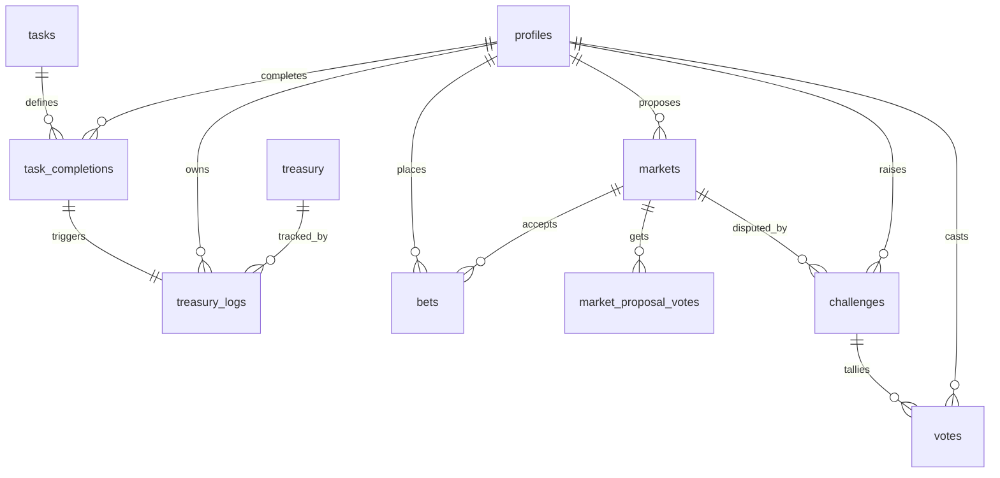

# 1. Supabaseデータベース設計

対象SQL: [`sql/0001_init_schema.sql`](./sql/0001_init_schema.sql)

## 資金循環モデル



**「労働 ➔ 金庫 ➔ 予測プール」** の流れは `treasury_logs` 1テーブルに正規化しています。1行が「ユーザー残高への影響 (`points_delta`)」と「金庫残高への影響 (`treasury_delta`)」を同時に持つ、簡易的な複式簿記になっています。

| entry_type | points_delta | treasury_delta | 発生タイミング |
|---|---|---|---|
| `task_reward` | + | + | 広告視聴/アンケート完了を検証した瞬間。ユーザーの労働が生んだアテンション価値を、ユーザー残高への付与と同時に金庫にも積み立てる |
| `bet_placed` | − | 0 | ベット時にユーザー残高から減算（プールは `bets` テーブル自体が原資） |
| `rake_collected` | 0 | + | マーケット確定時、総プールからテラ銭(既定10%)を金庫へ徴収 |
| `bet_payout` | + | 0 | マーケット確定時、的中者へプール山分け分配 |
| `bet_refund` | + | 0 | マーケット中止（`cancelled`）時の返金 |
| `treasury_grant` | + | − | 運営/DAOが金庫から個別ユーザーへポイントを付与（新規登録ボーナス等） |
| `adjustment` | ± | ± | 手動補正 |

`bet_placed`以降(`rake_collected`〜`treasury_grant`)のRPCはこの設計の対象範囲を明確にするための参考実装で、今回のコア納品（依頼事項2）は `task_reward` の自動化ロジックです。同じ台帳パターンを使い回せるよう `treasury_logs` は汎用スキーマにしてあります。

## テーブル一覧

### `profiles`
`auth.users` を1:1で拡張。`points_balance` はユーザーの利用可能ポイント（キャッシュ値、真実のソースは `treasury_logs` の合計）。

### `treasury`
シングルトン行（`id=1`固定）でコミュニティ金庫の残高を保持。広告収益の割り当て分・テラ銭収入がここに積み上がる。

### `tasks`
広告視聴(`ad_view`)・アンケート(`survey`)の定義。`config` (jsonb) に広告ユニットIDやアンケート設問IDを格納し、`max_completions_per_user` で連打防止。

### `task_completions`
完了1回＝1行。`idempotency_key` にUNIQUE制約を付け、広告ネットワークのコールバック重複や多重送信でも二重付与されないようにしている。

### `treasury_logs`
上記の通り、資金循環全体の単一台帳。

### `markets`
サッカー試合1つ＝1マーケット。`source` で自動生成(`api_auto`)かユーザー提案(`user_proposed`)かを区別。`status` は以下のライフサイクルを持つ：

```
proposed → open → locked → pending_resolution → (disputed →) resolved
                                              ↘ cancelled
```

- `kickoff_time` を過ぎたら `open → locked` に遷移させ、以後のベットを拒否する（ステータス遷移はcronジョブ or ベットAPI側のガードで実施）。
- `dispute_deadline` は一次判定確定時刻+24時間で設定し、Optimistic Oracleの異議申し立て期限として使う。

### `market_proposal_votes`
ユーザー提案お題への「賛成票」。一定数（アプリ側の閾値、例: 20票）に達したら `markets.status` を `proposed → open` に自動昇格させる。

### `bets`
パリミュチュエル方式のステーク。オッズは事前固定ではなく、確定時にプール按分で決まるため `odds` カラムは持たない。`market_pools` ビューでリアルタイムのプール状況を参照できる。

### `challenges` / `votes`
Optimistic Oracleの異議申し立てとDAO多数決投票。`challenges.voting_deadline` までに閾値の投票が集まらない場合は一次判定を確定させる運用を想定。

## RLSの方針
残高を変更するすべての操作（タスク報酬、ベット、精算）は `SECURITY DEFINER` のRPC関数経由のみで許可し、クライアントロール（`anon`/`authenticated`）には直接のUPDATE権限を与えない。RLSポリシーは読み取りと、残高に影響しないINSERT（マーケット提案、賛成投票、異議申し立て、DAO投票）のみに限定している。
