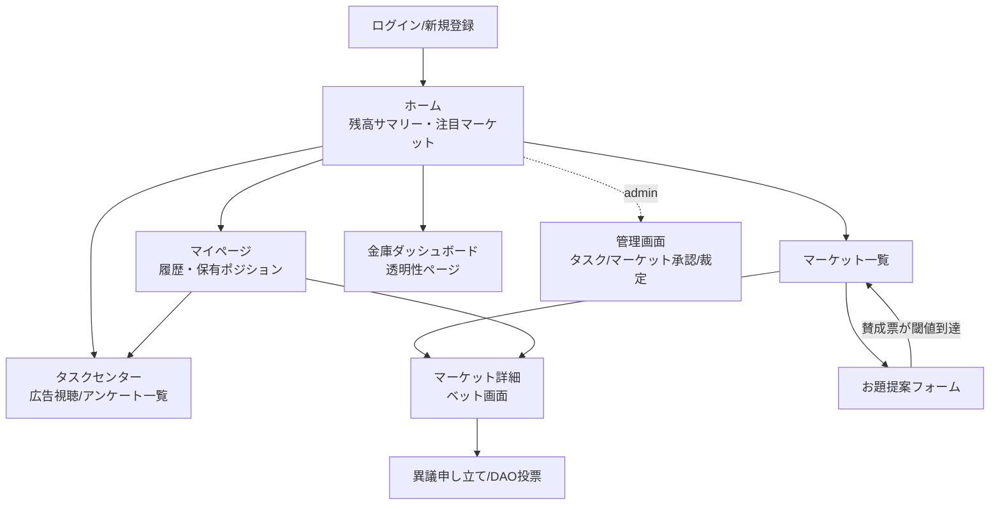

# 3. 画面構成（ワイヤーフレーム）案

視覚版はArtifactとしても共有しています。以下はサイトマップと主要画面のASCIIワイヤーフレームです。

## サイトマップ



## 主要画面

### ホーム
```
┌─────────────────────────────────────────────┐
│ [ロゴ] Prediction DAO      ポイント: 1,240pt │
├─────────────────────────────────────────────┤
│  金庫(Treasury)残高: 3,482,000pt  [詳細>]     │
│  ┌───────────────┐ ┌───────────────┐        │
│  │ 今日のタスク   │ │ 注目マーケット │        │
│  │ 広告視聴 x3    │ │ 日本 vs 韓国   │        │
│  │ アンケート x1  │ │ 開始まで 2:15  │        │
│  │ [タスクへ >]   │ │ [ベットする >] │        │
│  └───────────────┘ └───────────────┘        │
│  受付中のマーケット一覧                       │
│  ┌─────────────────────────────────────┐    │
│  │ ⚽ 浦和 vs 鹿島   H 42% D 21% A 37%  │    │
│  │ ⚽ 横浜FM vs G大阪 H 55% D 18% A 27% │    │
│  └─────────────────────────────────────┘    │
├─────────────────────────────────────────────┤
│ [ホーム] [タスク] [マーケット] [マイページ]    │
└─────────────────────────────────────────────┘
```

### タスクセンター（広告視聴 / アンケート）
```
┌─────────────────────────────────────────────┐
│ タスクセンター                                │
├─────────────────────────────────────────────┤
│ [広告視聴] [アンケート] [完了履歴]  ← タブ    │
│                                               │
│ ┌───────────────────────────────────────┐   │
│ │ 🎬 動画広告を見て 10pt 獲得             │   │
│ │ 本日の残り回数: 2/3        [視聴する]  │   │
│ ├───────────────────────────────────────┤   │
│ │ 📋 サッカーファンアンケート 50pt        │   │
│ │ 所要時間 目安2分            [回答する] │   │
│ └───────────────────────────────────────┘   │
│                                               │
│ 完了すると自動でポイント付与＆金庫に加算されます │
└─────────────────────────────────────────────┘
```

### マーケット一覧
```
┌─────────────────────────────────────────────┐
│ マーケット一覧      [受付中|終了間近|終了済]   │
│ カテゴリ: [サッカー ▼]     [+ お題を提案]      │
├─────────────────────────────────────────────┤
│ ⚽ 浦和レッズ vs 鹿島アントラーズ              │
│    2026/08/05 19:00 開始 (あと 1日3時間)      │
│    ホーム 42%  引分 21%  アウェイ 37%          │
│    プール合計: 128,400pt          [詳細 >]    │
├─────────────────────────────────────────────┤
│ ⚽ 横浜F・マリノス vs ガンバ大阪 [受付終了]     │
│    判定待ち（一次判定まで残り 3時間）           │
└─────────────────────────────────────────────┘
```

### マーケット詳細 / ベット
```
┌─────────────────────────────────────────────┐
│ ⚽ 浦和レッズ vs 鹿島アントラーズ               │
│ 2026/08/05 19:00 キックオフ  [受付中]          │
├─────────────────────────────────────────────┤
│  現在のプール比率（パリミュチュエル、確定オッズ  │
│  ではなく随時変動）                            │
│  ホーム勝ち  ██████████░░░░░░░░  42%           │
│  引き分け    █████░░░░░░░░░░░░░  21%           │
│  アウェイ勝ち ████████░░░░░░░░░  37%           │
│  総プール: 128,400pt / 運営手数料10%控除後分配   │
├─────────────────────────────────────────────┤
│  ベットする:                                  │
│  [ホーム] [引分] [アウェイ]   金額: [___]pt    │
│  想定配当（現時点の按分想定）: 約 x2.1          │
│                          [ベットを確定する]     │
├─────────────────────────────────────────────┤
│  ⚠ キックオフ後は自動的にベット不可になります    │
└─────────────────────────────────────────────┘
```

### お題提案フォーム
```
┌─────────────────────────────────────────────┐
│ お題を提案する                                │
├─────────────────────────────────────────────┤
│ 試合名: [____________________]               │
│ カテゴリ: [サッカー ▼]                        │
│ キックオフ日時: [____/__/__ __:__]            │
│ 説明: [_____________________________]         │
│                          [提案を投稿]         │
├─────────────────────────────────────────────┤
│ 承認待ちの提案                                │
│ ・浦和 vs FC東京   賛成 14/20  [賛成する]      │
│   → 賛成票が20に到達すると自動でオープンされます │
└─────────────────────────────────────────────┘
```

### 異議申し立て / DAO投票
```
┌─────────────────────────────────────────────┐
│ 判定結果: 浦和レッズ vs 鹿島アントラーズ         │
│ 一次判定: ホーム勝ち（API自動判定）             │
│ 異議申し立て期間: 残り 18時間32分                │
├─────────────────────────────────────────────┤
│ [異議を申し立てる]                            │
│                                               │
│ ── 異議が出た場合 ──                          │
│ 異議内容: 「延長戦の結果が反映されていない」      │
│ 証拠URL: xxx.com/result                      │
│                                               │
│ DAO投票 (締切まで 6時間)                       │
│ ホーム勝ち ███████░░ 68%                      │
│ 引き分け  ██░░░░░░░ 20%                       │
│ アウェイ勝ち █░░░░░░░ 12%                      │
│              [ホームに投票] [引分に投票] [ア…] │
└─────────────────────────────────────────────┘
```

### マイページ
```
┌─────────────────────────────────────────────┐
│ マイページ                                    │
│ 保有ポイント: 1,240pt                         │
├─────────────────────────────────────────────┤
│ [ベット履歴] [ポイント履歴] [タスク履歴]        │
│                                               │
│ ベット履歴                                    │
│ 浦和 vs 鹿島 | ホームに200pt | 結果待ち         │
│ 横浜FM vs G大阪 | アウェイに100pt | 的中 +230pt │
├─────────────────────────────────────────────┤
│ ポイント履歴（treasury_logsから生成）           │
│ +10pt  広告視聴タスク完了     08/04 10:20      │
│ +50pt  アンケート回答完了     08/03 21:03      │
│ -200pt ベット（浦和vs鹿島）    08/03 18:00      │
└─────────────────────────────────────────────┘
```

### 金庫ダッシュボード（透明性ページ・公開）
```
┌─────────────────────────────────────────────┐
│ コミュニティ金庫（Treasury）                   │
│ 現在残高: 3,482,000pt                         │
├─────────────────────────────────────────────┤
│ 残高推移グラフ（過去30日）                      │
│  ▁▂▃▃▄▅▅▆▆▇▇███                              │
│ 収益源の内訳                                  │
│  労働報酬（広告/アンケート）   62%             │
│  テラ銭（マーケット手数料）    38%             │
│ 直近のログ                                    │
│  +120pt task_reward  user:abc12 08/04 11:02   │
│  +840pt rake_collected market:浦和vs鹿島      │
└─────────────────────────────────────────────┘
```

## モバイルナビゲーション
下部タブ固定: `ホーム / タスク / マーケット / マイページ` の4本。管理者ロールのみヘッダー右端に「管理画面」リンクを表示。
