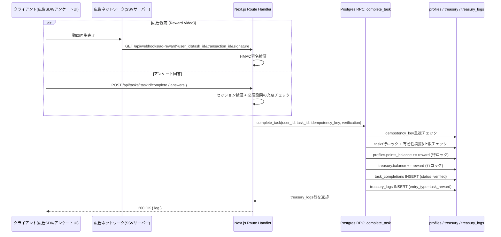

# 2. タスク完了 → 自動ポイント付与・金庫更新のバックエンドロジック

対象コード:
- SQL RPC: [`sql/0002_task_completion_rpc.sql`](./sql/0002_task_completion_rpc.sql)
- 共通クライアント: [`api/lib/supabaseAdmin.ts`](./api/lib/supabaseAdmin.ts)
- アンケート完了API: [`api/tasks/[taskId]/complete/route.ts`](./api/tasks/%5BtaskId%5D/complete/route.ts)
- 広告視聴Webhook: [`api/webhooks/ad-reward/route.ts`](./api/webhooks/ad-reward/route.ts)

これらは実際のNext.js App Router構成での配置パス（`app/api/...`）に合わせたファイル名にしてあります。プロジェクトを`create-next-app`で立ち上げる際は `docs/prediction-market-dao/api/` の中身を `app/api/` にそのままコピーしてください。

## 全体フロー

## 設計ポイント

**1. 検証はサーバー側のみで完結させる。**
アンケートは `tasks.config.required_question_ids` を正とし、クライアントが送った回答がその設問を全て含むかをサーバーで再検証してから報酬を確定する。広告視聴はクライアントを一切信用せず、広告ネットワークが送るサーバー間コールバック（SSV: Server-Side Verification）のHMAC署名でのみ検証する。

**2. 二重付与防止は`idempotency_key`ベースで行う。**
広告は `ad:<network_transaction_id>`、アンケートは `survey:<task_id>:<user_id>` を鍵にし、`task_completions.idempotency_key` のUNIQUE制約でDBレベルにも二重防止を持たせている。広告ネットワークはコールバックが失敗すると再送してくるため、重複検知時は200系を返してリトライを止める（`ad-reward/route.ts` 参照）。

**3. 残高更新はPostgres RPC 1トランザクション内でatomicに行う。**
`profiles`・`treasury`両方の残高更新と`task_completions`・`treasury_logs`への書き込みを、`complete_task`という1つの`SECURITY DEFINER`関数にまとめている。API Route側は薄いバリデーション層に徹し、実際の資金移動ロジックはDB層に閉じ込めることで、複数リクエストが同時に来ても`FOR UPDATE`の行ロックで競合を防いでいる。

**4. RPCはservice-roleのみ実行可能。**
`revoke execute ... from anon, authenticated` により、クライアントから直接RPCを叩いてポイントを自己申告で盛ることはできない。必ずAPI Route（サーバー環境変数 `SUPABASE_SERVICE_ROLE_KEY` を保持）を経由する。

## 必要な環境変数

| 変数名 | 用途 |
|---|---|
| `NEXT_PUBLIC_SUPABASE_URL` | Supabaseプロジェクトの URL |
| `SUPABASE_SERVICE_ROLE_KEY` | サーバー側のみで使うservice-roleキー（クライアントに絶対に露出させない） |
| `AD_NETWORK_SSV_SECRET` | 広告ネットワークのSSVコールバック署名検証用の共有シークレット |

## 追記: このドキュメント後に実装したもの

このドキュメントは最初の設計フェーズの成果物で、当時は `place_bet` / `settle_market` / Optimistic Oracle のワークフローをスコープ外としていましたが、その後の開発で同じ台帳パターン（`treasury_logs`）を使って実装済みです。実際のコードとRPCは以下を参照してください。

- `supabase/migrations/00000000000003_bet_and_settlement_rpc.sql` : `place_bet` / `settle_market`（stake-back保証つきの配当計算） / `propose_market` / `vote_market_proposal`
- `supabase/migrations/00000000000004_stake_back_and_optimistic_oracle.sql` : 配当計算の修正、`submit_provisional_result` / `finalize_expired_markets`（一次判定 → 異議申し立て期間 → 自動確定 or DAO投票確定）
- ルートハンドラ一式は `app/api/markets/`, `app/api/challenges/` 配下

未実装のまま残っているのは、`README.md`の「次のステップ」に記載の通り、スポーツAPI連携によるマーケット自動生成と、本番Supabaseプロジェクトへの接続のみです。
